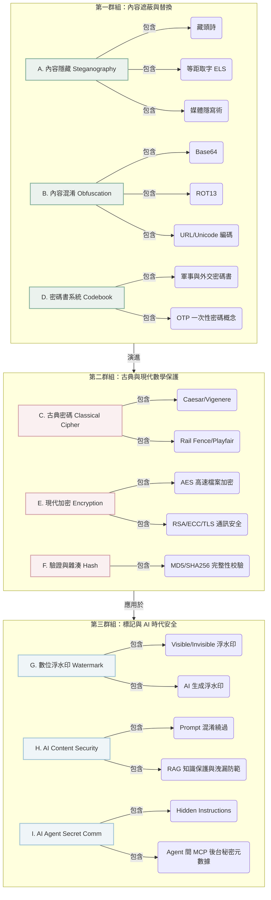

# 知識分類地圖 (Concept Map)

> **專案作者**：Falo x Force Cheng  
> **建立日期**：2026/06/15  
> **知識體系**：Formosa AI Life Outlook (FALO) 知識發行與 Taiwan AI Audit 治理架構  

⸻

## 一、知識分類全景 (Taxonomy)

FALO Content Cipher Lab 將資訊保護與轉換技術劃分為三大核心群組，共九個分類模組。這個地圖展示了從「最古老的物理遮蔽」到「最前沿的 AI 協定治理」的演進脈絡。

⸻

## 二、核心關聯說明

1. **A 與 D 的區別 (位置 vs 語意)**：
   * **A. 內容隱藏**：隱藏的是「秘密的所在位置」。大眾看到的是正常的聖經或散文，但只有知道偏移量（步長 $N$）的接收者，才能在特定字元上把字取出來。
   * **D. 密碼書系統**：隱藏的是「詞彙的實際語意」。大眾看得到傳輸內容（如 `888 220 305`），但不知道每個代號的意思。
2. **B 與 E 的區別 (轉換 vs 加密)**：
   * **B. 內容混淆**：是無金鑰的可逆轉換（如 Base64），不具備資訊安全性，僅提供通訊管道相容性。
   * **E. 現代加密**：是基於數學難題與密鑰的保密技術，沒有金鑰則在物理上無法還原。
3. **G、H、I 與 AI 治理（AI Governance）**：
   * 在 Formosa AI Life Outlook (FALO) 的 AI Workflow 實踐中，當 Agent 自動化運行並處理大量數據時，雜湊（F）用於校驗代碼與模型權重的一致性；數位浮水印（G）用於標記內容來源；而 AI 內容安全（H）與 Agent 隱密通訊（I）則是用於防範提示詞攻擊，保障知識產權與審計追溯鏈的完整。
4. **AIAP 規劃與治理職能映射**：
   * 本專案設有專屬的 [iPAS AIAP 關聯地圖](10_ipas_aiap_map.md)，說明上述九大模組如何直接映射至 AI 應用規劃師的資安合規、數據生命週期防護與可信任 AI 審計工作。

⸻

**專案貢獻與維護者**：
* Force Cheng (Falo x Force Cheng) - 專案發起人
* FALO Open Source Community & Partners - 開源協作與維護團隊

*Falo x Force Cheng 2026/06/15*
